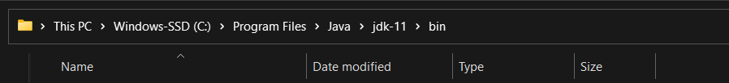
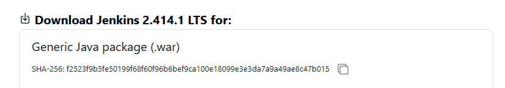

# Download and installation
- Follow this youtube tutorial : https://www.youtube.com/watch?v=1_Zs0gQq1Yc
    OR 
- Follow step by step guide:
    - Install Java Development Kit (JDK) : 
        - Download JDK 8 from here  
            https://www.oracle.com/in/java/technologies/downloads/#java11-windows
        
    -  Set the Path for the Environmental Variable for JDK :
        - Go to System Properties. Under the "Advanced system setting" tab, select Environment Variables.
        - Under system variables, select "new." Then copy the path of the JDK-11/bin folder and paste it in the corresponding value field. 
            
        - Under system variables, set up a bin folder for JDK in PATH variables. 
        - Go to command prompt and type the following to check if Java has been successfully installed:
            ```
                java -version
            ```
    - go to jenkins official docs and download Generic java package : https://www.jenkins.io/download/
        

    - Copy the path of above downloaded .war file and use the command: 
        e.g: java -jar C:\Users\nehal\Downloads\jenkins.war
        ```
            java -jar YOUR_FILE_PATH
        ```

    - Run Jenkins on Localhost 8080
        - Once Jenkins is installed, explore it. Open the web browser and type "localhost:8080". 
        - Enter the credentials and log in. If you install Jenkins for the first time, the dashboard will ask you to install the recommended plugins. Install all the recommended plugins.

    - Jenkins Server Interface
        - New Item allows you to create a new project.
        - Build History shows the status of your builds.
        - Manage System deals with the various configurations of the system.

